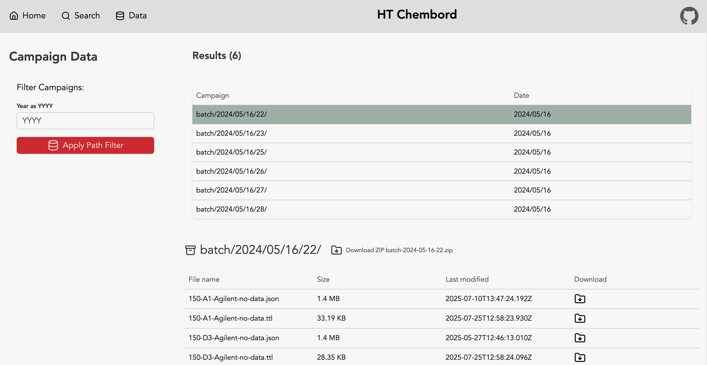
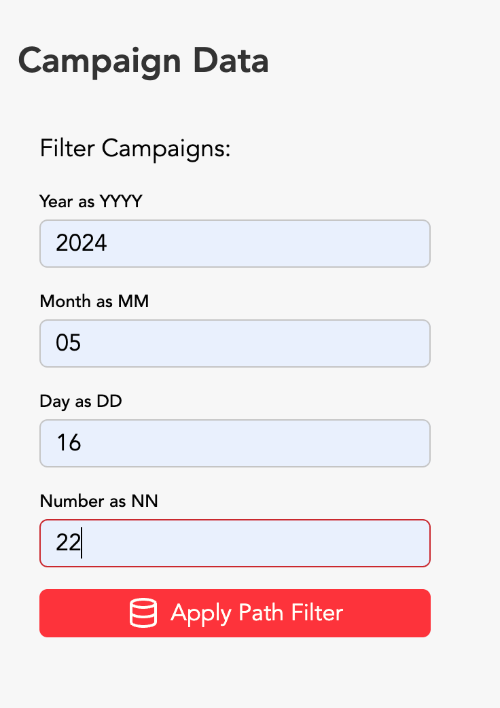
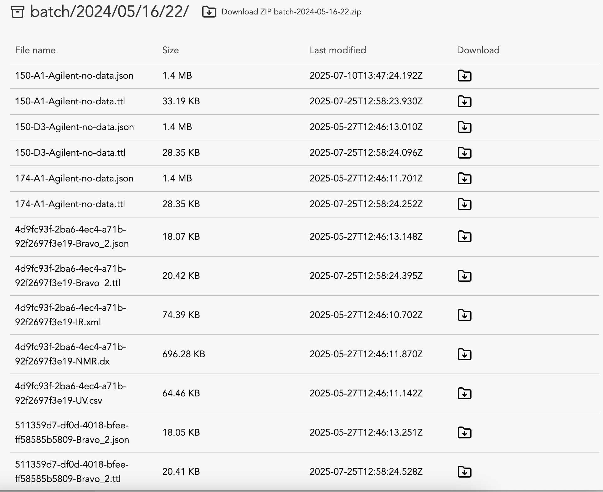
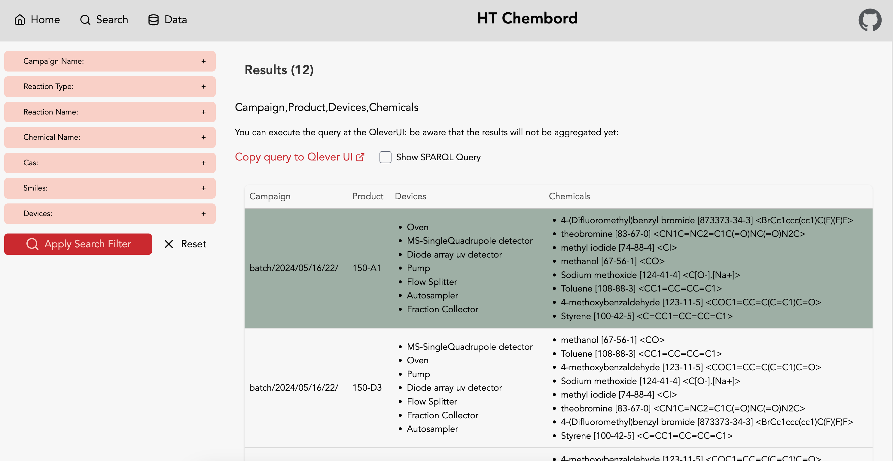
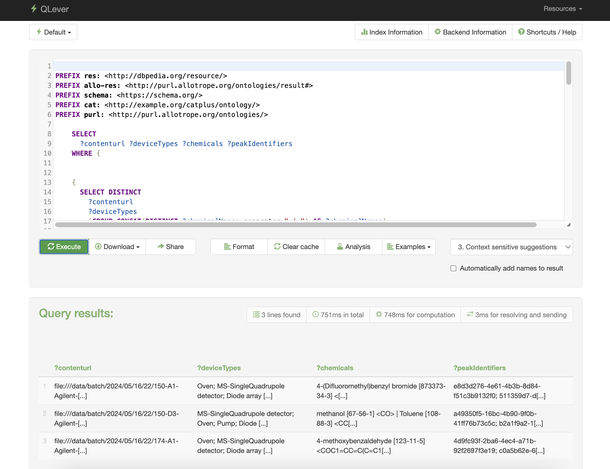
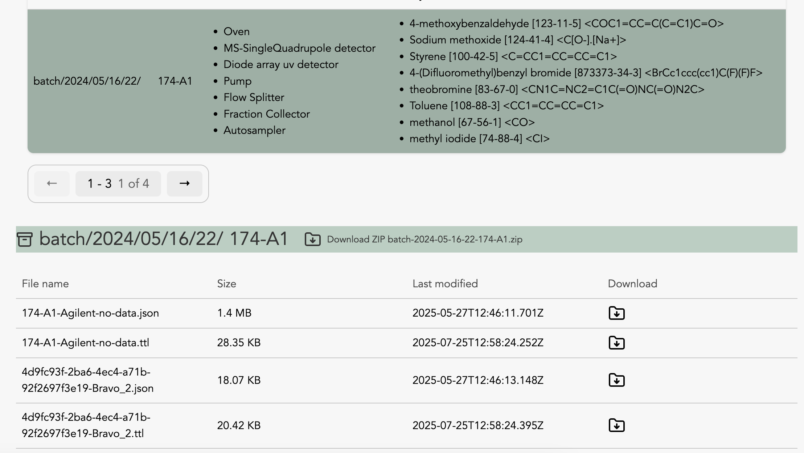

# Front-end (User Interface)

The Cat+ front-end (UI) is at this repository:

[catplus-chemboard](https://github.com/sdsc-ordes/catplus-chemboard).

## Technology

The frontend uses the following technologies:

- [Sveltekit](https://svelte.dev/) as Frontend Framework
- [pnpm](https://pnpm.io/) for node setup
- [Skeleton UI](https://www.skeleton.dev/) for the styles

## Architecture

The frontend offers two perspectives on the data of the catplus project:

- `data` route: filtering data in S3
- `search` route: searching for data with sparql queries via connection to the [catplus qlever endpoint](https://catplus.swisscustodian.ch/default/)


```mermaid
graph TD
    subgraph "User Interface"
        Frontend[🌐 Frontend Application]
    end

    subgraph "Data & Query Services"
        S3[🗄️ S3 Database]
        SPARQL[fa:fa-project-diagram SPARQL Endpoint QLever]
    end

     Frontend -- "s3 connection for filtering" --> S3
     Frontend -- "qlever connection for search" --> SPARQL
```

## Frontend

The frontend has 3 routes:

- [Homepage](#homepage): here you find links to the other parts of the infrastructure, such as the Cat+ Organization and the Qlever  Interface.
- [Data](#data): Here you can search by campain in S3.
- [Search](#search): Here you can search by attributes via the qlever interface.

### Homepage


### Data

Here you can search by campaign in S3. Intially you will see the full result.



Via a search form you can filter by year, month, day or campaign sequence number.

{ width="300" }

The results on this page are full campaigns.

{ width="800" }

### Search

On the search page you can search for products by property values.



The search will be performed via the [qlever api](https://catplus.swisscustodian.ch/sparql/default/).

Via the search form you can make a selection.

{ width="300" }

The results contain a results summary section, that shows the total number of results for the search before pagination.


There you can click a checkbox to see the sparql query that was executed on qlever to receive the paginated result. You can also jump to the qlever UI to execute the query yourself there.



On this page the results are products not campaigns.



You can download individual files or all files for a product as a zip archive.

## Setup

### Prepare

Clone the repository.

```
git clone git@github.com:sdsc-ordes/catplus-chembord.git
cd catplus-chemboard
```

Set up the environment variables.

```
cp .env.example .env
```

You need to set the following environment variables:

```
# External Links
PUBLIC_QLEVER_UI_URL=https://catplus.swisscustodian.ch/default
PUBLIC_CATPLUS_ONTOLOGY_URL=https://sdsc-ordes.github.io/catplus-ontology/
PUBLIC_SWISSCAT_URL=https://www.epfl.ch/research/facilities/swisscat/
PUBLIC_SDSC_URL=https://www.datascience.ch/
PUBLIC_CHEMBORD_GITHUB_URL=https://github.com/sdsc-ordes/catplus-chemboard.git

# Qlever Access
QLEVER_API_URL=https://catplus.swisscustodian.ch/sparql/default/

# S3 Access
S3_BUCKET_NAME=
AWS_REGION=
AWS_S3_ENDPOINT=
AWS_ACCESS_KEY_ID=
AWS_SECRET_ACCESS_KEY=

# Sveltekit Configuration
ORIGIN=http://localhost:3000
PUBLIC_RESULTS_PER_PAGE="3"
```

You are now ready to start the application.

### Pre-requisites

The development setup requires the following:

- nix
- just

Additionally, we recommend using direnv to automatically activate the development environment when entering the project directory.

### Build and serve

Then use just to install, build and run the project:

```
just install
just build
just local
```

`just local` serves the chembord at http://localhost:5173/chembord


